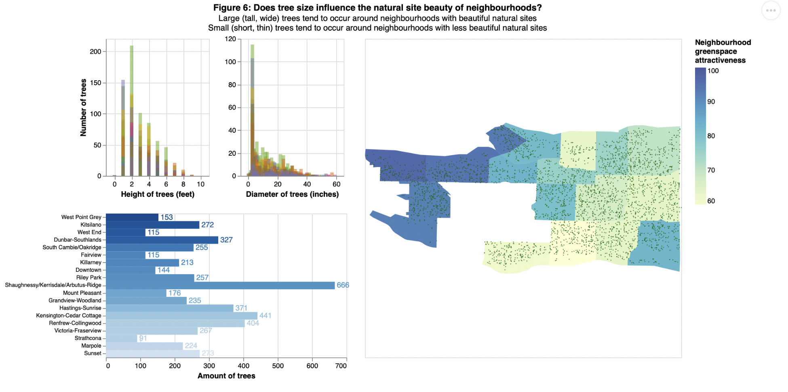
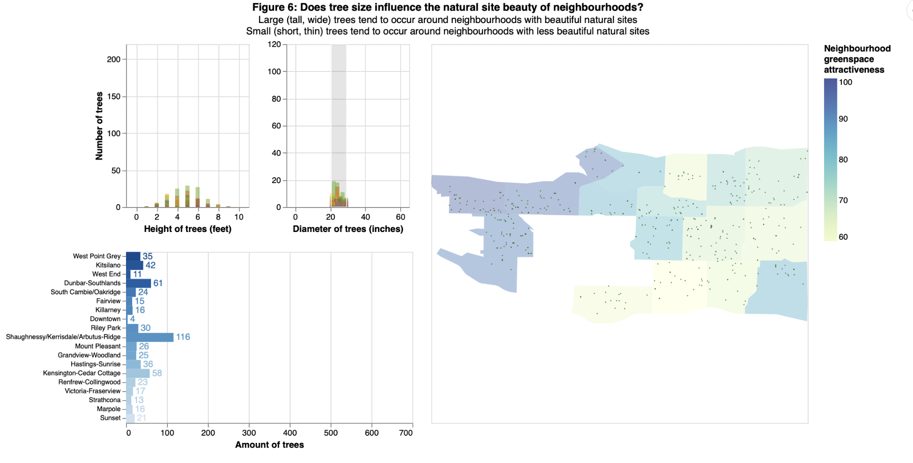
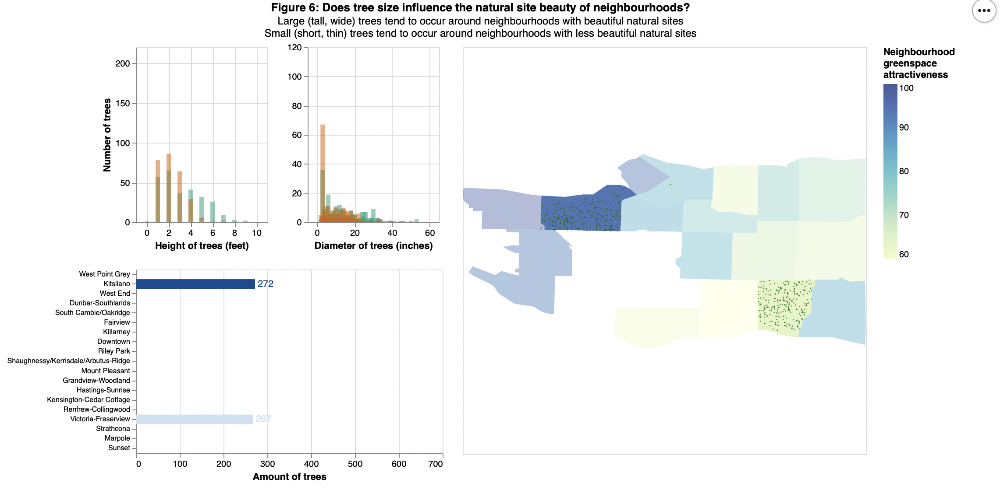

# Vancouver_Trees_Viz
This project involves exploratory data visualization on properties of trees related to attractive greenspaces in Vancouver.

The primary findings from this investigation suggest attractive greenspaces tended to contain taller and wider trees (relative to less attractive greenspaces). In contrast, the number of trees, and diversity of tree species were not correlated to greenspace attractiveness. Future work using more rigorous methodology may be needed to verify the role that tree height/diameter plays in creating attractive greenspaces, which could inform urban planning.

A dashboard summarizing the findings is also provided in the screenshots below, with interactivity in three out of the four charts (bottom left bar chart is not interactive).

# Main dashboard

# Example of main dashboard with filters

