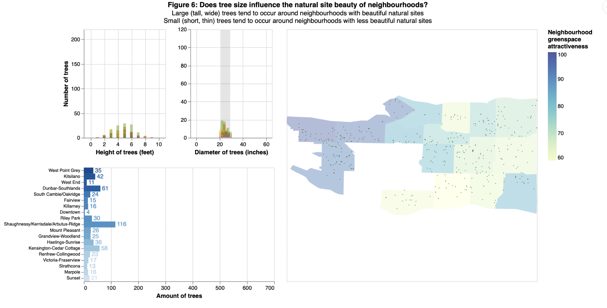

# Vancouver_Trees_Viz
This project involves exploratory data visualization on properties of trees related to beautiful greenspaces in Vancouver. 

The primary findings from this investigation suggest that taller and wider trees are correlated to attractive greenspaces in Vancouver. Future work using more rigorous methodology may be needed to verify the role these factors play in creating attractive greensapces, which could inform urban planning.

A dashboard summarizing the findings is also provided in the screenshots below, with interactivity in three out of the four charts (bottom left bar chart is not interactive).

